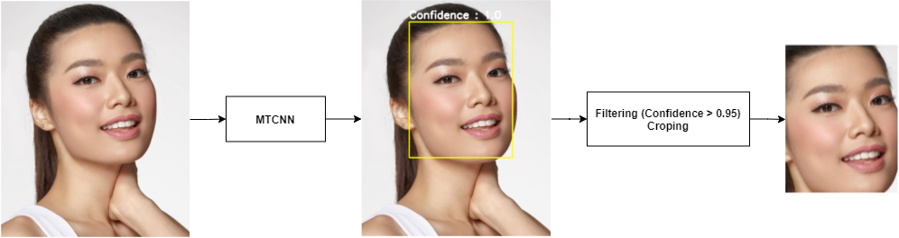
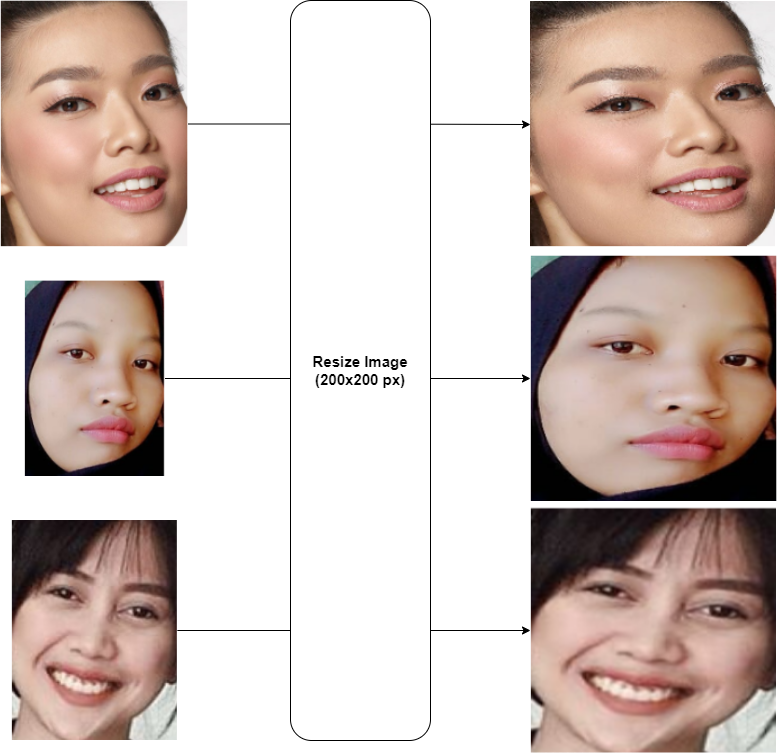
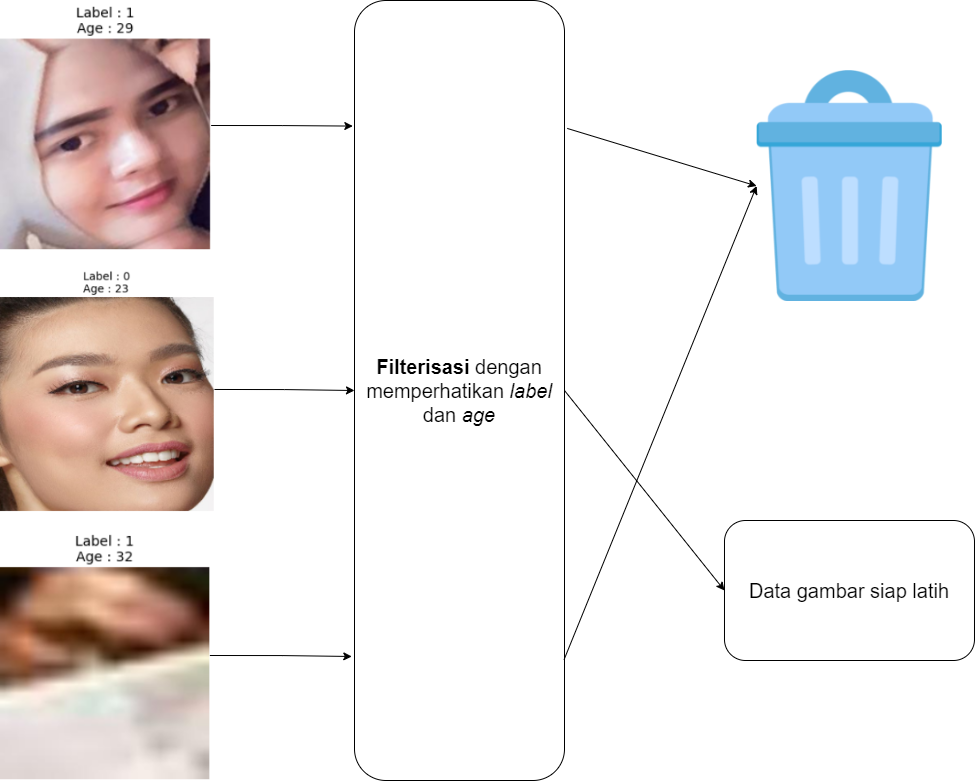
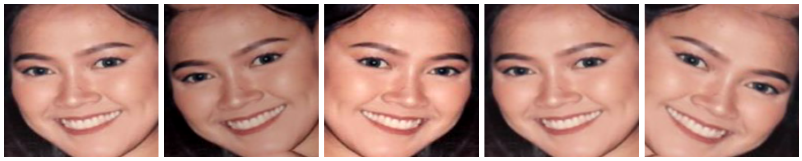

# BDC - Satria Data 2021

Tim : Blazing Trio | `SD20210000722`

Repo untuk merekam segala resources dalam lomba BDC - Satria Data tahun 2021.

## Dataset

Dataset hasil preprocessing dan augmentasi dapat diakses lewat platform berikut.

 

## [Notebook](./notebook)

Beberapa notebook yang kami gunakan untuk mengerjakan challenge.

1. `[STARTER] BDC - 2021` : Starter notebook untuk mengerjakan challenge pertama dalam `BDC - Satria Data 2021`.
2. `[PREPROCESS] BDC - 2021` : Notebook untuk melakukan preprocessing terhadap data gambar.
3. `[GENDER] BDC - 2021` : Final notebook untuk challenge pertama yaitu gender detection.
4. `[AGE] BDC - 2021` : Final notebook untuk challenge kedua yaitu age detection.

## Preprocessing

Melakukan preprocessing data gambar yang akan dilatih kedalam model.

1. [**MTCNN**](https://github.com/ipazc/mtcnn)

   Menggunakan `MTCNN` untuk mengambil daerah sekitar wajah, dilakukan filtering terhadap hasil dari
   `MTCNN` dengan `confidence score > 0.95` [FINAL]

   

2. Resizing Image

   Ubah ukuran data gambar menjadi `200 x 200` pixel [FINAL]

   

3. Filtering

   Filterisasi gambar yang akan digunakan untuk training model.

   

   - `excluded-age.txt` : Daftar nama file/gambar yang dihilangkan karena tidak baik digunakan untuk pelatihan model "umur"
   - `excluded-gender.txt` : Daftar nama file/gambar yang dihilangkan karena tidak baik digunakan untuk pelatihan model "gender"

4. Normalize

   Normalisasi data gambar => Mengubah distribusi nilai dalam matrix gambar menjadi berada dalam selang `0 - 1` dengan cara membagi nilai yang ada di dalam matrix dengan `255` [FINAL]

## Augmentasi

Melakukan augmentasi untuk memperbanyak data. Metode augmentasi yang digunakan yaitu:

1. Horizontal flip dengan peluang `0.4`
2. Donwscale kualitas gambar pada range `0.6 - 0.9` dengan peluang `0.3`
3. Random rotate dengan rentang `-30` sampai `30` derajad dengan peluang `0.6`
4. Shift, scale, dan rotate gambar dengan peluang `0.4`
5. Blur dengan peluang `0.4`
6. Random brightness pada rentang limit `-0.25` sampai `0.15` dengan peluang `0.4`

Digunakan library [`albumentations`](https://github.com/albumentations-team/albumentations) untuk melakukan hal diatas. Setiap gambar yang ada didata `train`
akan digandakan sebanyak `3x` untuk mendapatkan data yang baru.

## Modelling

**Weight** dari model yang digunakan untuk submission oleh kelompok `SD20210000722` ada [disini](./models)

1. Gender Detection

   Berikut adalah arsitektur model yang tim kami gunakan untuk pendeteksian gender.

   

2. Age Detection

   Berikut adalah arsitektur model yang tim kami gunakan untuk pendeteksian umur.

   

© Blazing Trio 2021
